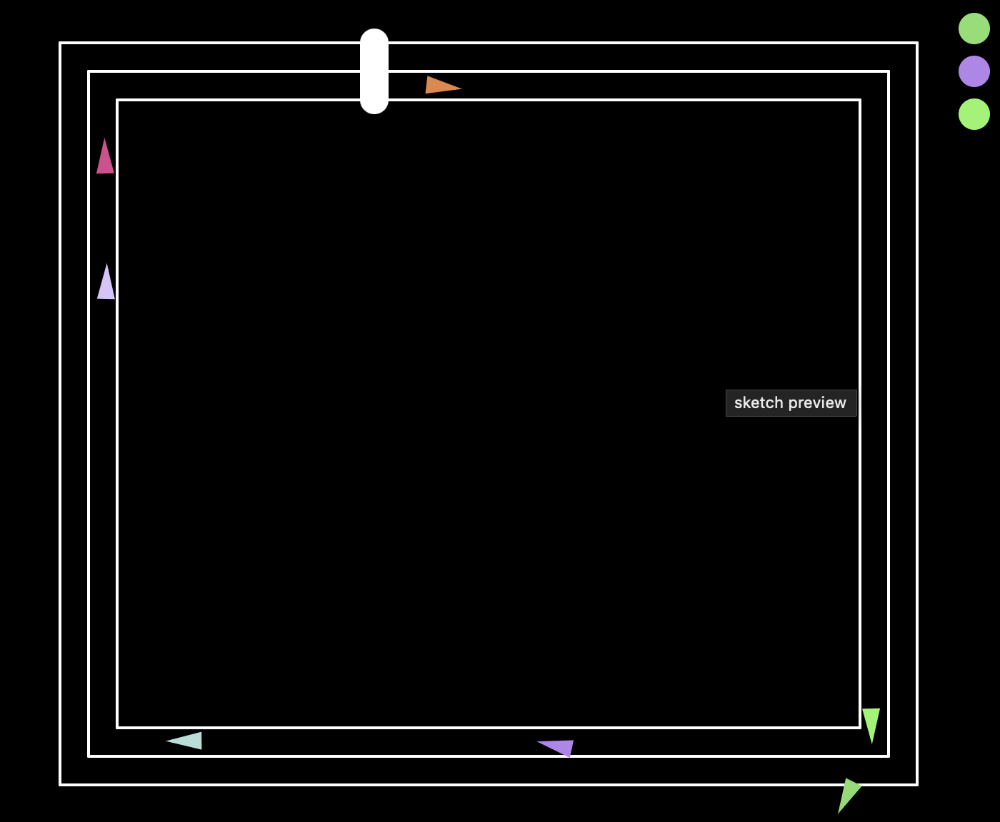

# racing-sim
p5.js racing simulation featuring AI-driven vehicles that navigate a track using flocking behaviors and path-following algorithms.

### Overview
Vehicles employ separation, alignment, and cohesion to race together while using predictive steering to stay on course. The simulation includes lap tracking, collision avoidance, and dynamic vehicle behaviors.

Try it for yourself at https://alex710joseph.github.io/racing-sim/

Use mouse click to spawn vehicles

